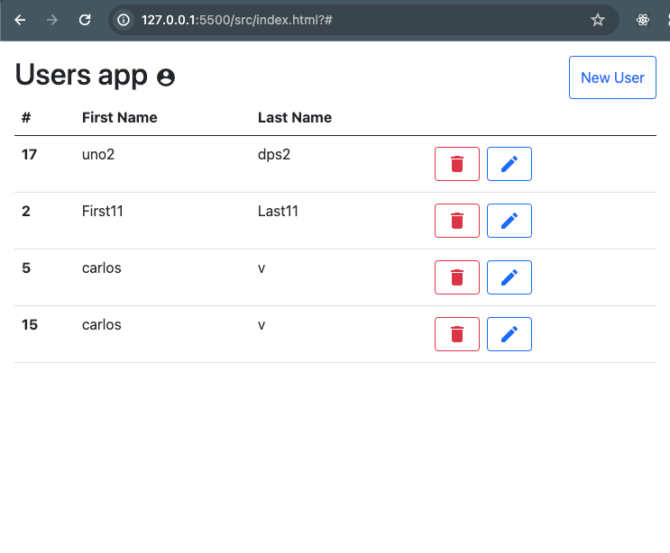
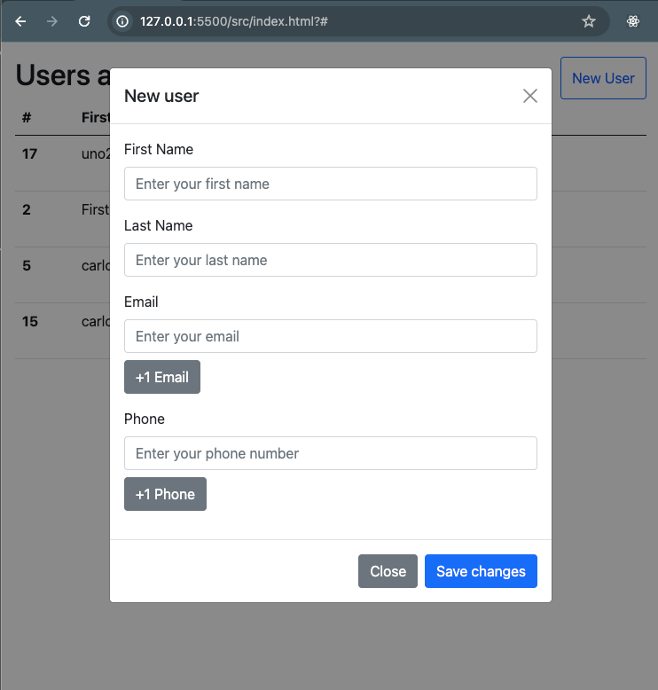
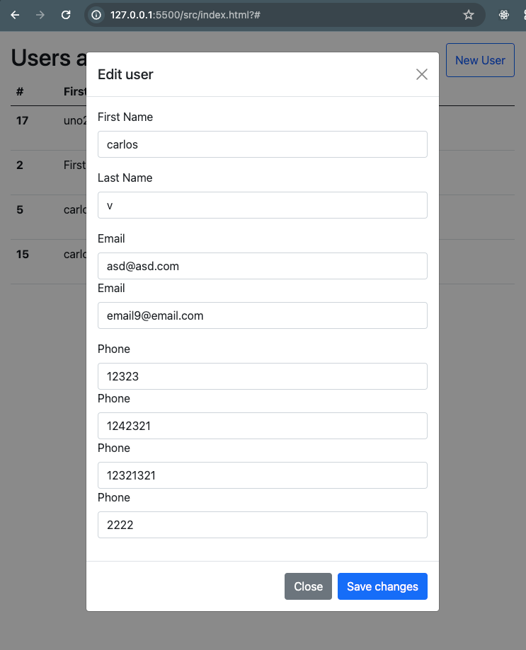
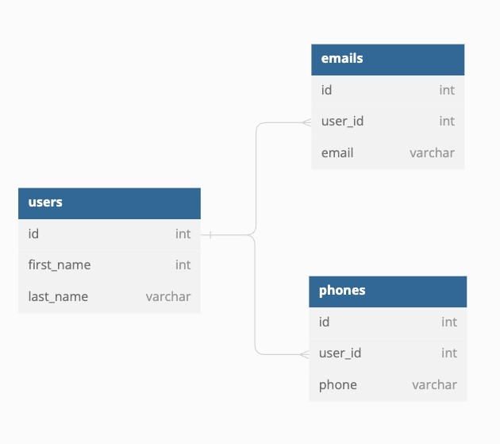

# Approach

To complete the objective of this app, an interface was developed with Javascript and a backend with Node js.

The frontend is a table with users with the possibility of editing and deleting them, also a button to create users.





Under the idea of ​​being able to create multiple emails and telephone numbers, the normalization of these tables was carried out with their respective relationships from one user to many emails and phones.



# Users Core Backend API

This is the backend of a users managment application that allows create, update and delete users. It is developed with Node.js, Express, PostgreSQL and also Prettier, Eslint and Husky to code formatter.

## Requirements and Configuration

Ensure Node.js and PostgreSQL are installed. Set up the database and adjust environment variables as needed.

## Installation and Execution

    1. Clone the repository: git clone <URL>

    2. Install dependencies: npm install

    3. Configure environment variables in a .env file.

    4. Run the application: npm start

## Folder Structure

The project follows an organized structure inspired by the MVC (Model-View-Controller) architecture, enhancing maintainability and clarity. Key components are organized as follows:

    /src: Contains the application's source code.
        /controllers: Controllers handling business logic.
        /models: Database model definitions.
        /routes: Application routes directing HTTP requests to corresponding controllers.
        /services: Services encapsulating application logic and shareable between controllers.
            /db: Service to db conection

## API Reference

#### Get all users

```http
  GET /user?userId={userId}
```

#### Get user

```http
  GET /users
```

#### Create user

```http
  POST /user
```

| Parameter   | Type     | Description                  |
| :---------- | :------- | :--------------------------- |
| `firstName` | `string` | **Required**. Full name user |
| `lastName`  | `string` | **Required**. Full name user |
| `phone`     | `number` | **Required**. Phone user     |
| `email`     | `string` | **Required**. Email user     |

#### Update user

```http
  PUT /users?userId={userId}
```

| Parameter   | Type     | Description           |
| :---------- | :------- | :-------------------- |
| `userId`    | `number` | **Required**. Id user |
| `firstName` | `string` | Full name user        |
| `lastName`  | `string` | Full name user        |
| `phone`     | `number` | Phone user            |
| `email`     | `string` | Email user            |

#### Delete user

```http
  DELETE /users?userId={userId}
```

| Parameter | Type     | Description           |
| :-------- | :------- | :-------------------- |
| `userId`  | `number` | **Required**. Id user |
